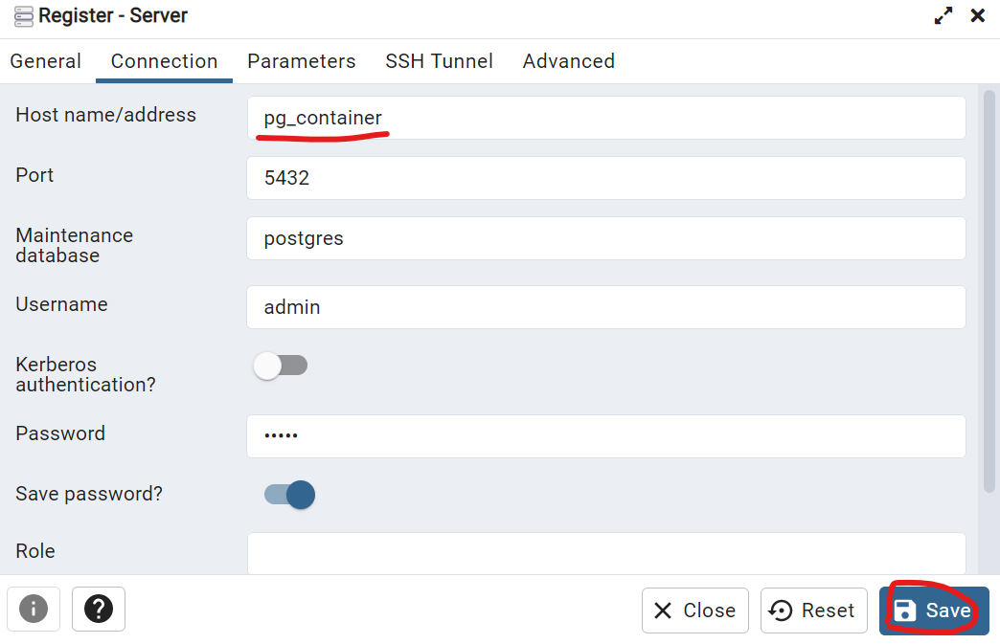

# SpringBootExample
Project for later reference in springboot

## Oracle 17 JDK
- Link: [Installation Chocolatey](https://community.chocolatey.org/packages/oracle17jdk#install)

*PS*: Run Powershell as Administrator
| Command |  Script | 
| --- | --- |
| Install |   choco install oracle17jdk |
| Upgrade |   choco upgrade oracle17jdk |
| Uninstall | choco uninstall oracle17jdk |

Test: 
* refreshenv
* java -version

## VSCode Extensions

* Spring Initializr in VSCode
* Spring Boot Dashboard
* Spring Boot Tools
* Spring Boot Snippets
* Extension Pack for Java
* Lombok Annotations Support for VS Code
* IntelliJ Neo Dark

## Setup Postegres + PGAdmin
* Link Medium: [How to Run PostgreSQL and pgAdmin Using Docker](https://towardsdatascience.com/how-to-run-postgresql-and-pgadmin-using-docker-3a6a8ae918b5)
* [PgAdmin localhost:5050](http://localhost:5050/)

